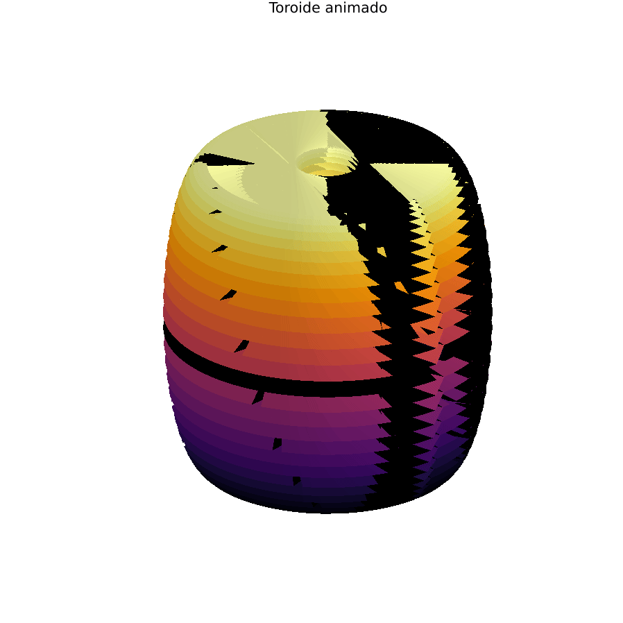
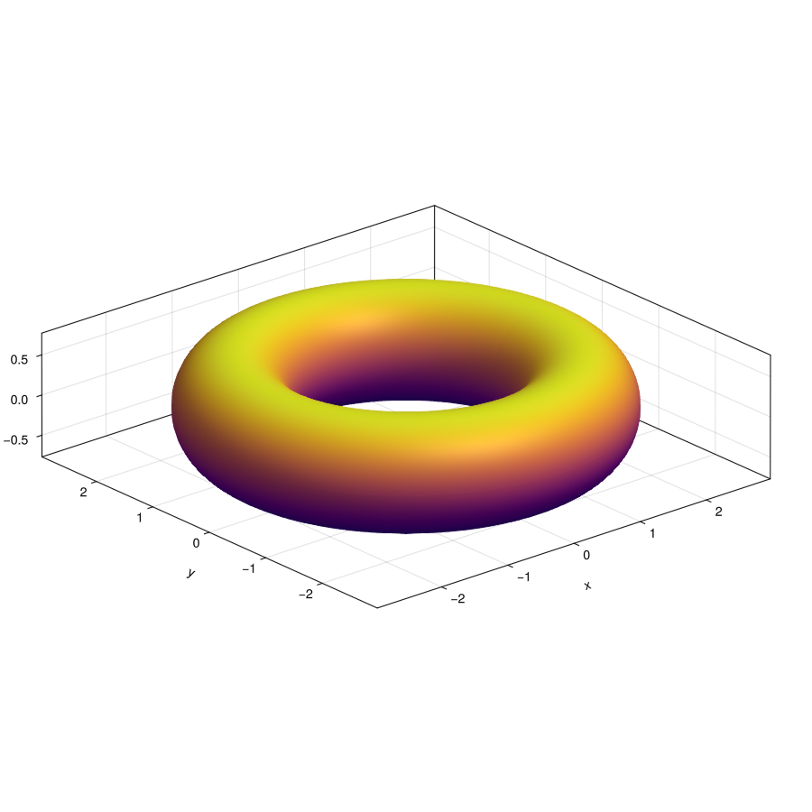

# Julia fractal lab

> Exploración de fractales, usando Julia.
> Dinámica compleja, caos, sistemas iterativos desde cero.

## Descripción.

Esto que estoy dejando acá es un laboratorio personal donde estaré explorando la generación de fractales mediante algoritmos matemáticos implementados en julia.

Mi intención con esto es lograr comprender:

- Números complejos
- Métodos numéricos
- Sistemas dinámicos
- Caos determinista
- Iteración y convergencia

## Fractales implementados.

- Nombre: Newton-Raphson
- Idea: Cada punto del plano converge a una raíz distinta.

```math
z_{n+1} = z_n - \frac{f(z_n)}{f'(z_n)}
```

### Qué está pasando

El método de Newton-Raphson busca aproximar raíces de una función.

Partimos desde un punto inicial:

```math
z_n
```

Luego calculamos:

```math
\frac{f(z_n)}{f'(z_n)}
```

Donde:

- `f(z_n)` mide qué tan lejos estamos de una raíz
- `f'(z_n)` representa la pendiente local de la función

Esa fracción actúa como una corrección.

Finalmente:

```math
z_{n+1} = z_n - corrección
```

El algoritmo repite este proceso hasta acercarse a una raíz.

En el fractal, cada color representa una raíz distinta a la que converge el punto inicial.

**Resultado**


---

- Nombre: Mandelbrot Set
- Idea: determinar si una secuencia diverge o no

```math
z_{n+1} = z_n^2 + c
```

### Qué está pasando

En cada iteración tomamos el valor actual de `z` y lo elevamos al cuadrado:

```math
z_n^2
```

Luego le sumamos una constante compleja:

```math
+ c
```

El resultado genera el siguiente valor de la secuencia:

```math
z_{n+1}
```

Este proceso se repite miles de veces para cada punto del plano complejo.

Lo importante es observar el comportamiento de la secuencia:

- si los valores crecen indefinidamente → diverge
- si permanecen acotados → converge

Los puntos que no divergen forman el conjunto de Mandelbrot.

**Resultado**


---

- Nombre: Triángulo de Sierpinski
- Idea: generar un fractal mediante iteración de puntos hacia vértices de un triángulo (Chaos Game)

```math
p_{n+1} = \frac{p_n + v}{2}
```
Donde:

* ( p_n ) es el punto actual
* ( v ) es un vértice elegido aleatoriamente

### Qué está pasando

Este fractal no se dibuja directamente.

Surge a partir de una regla simple repetida muchas veces:
- elegir un vértice al azar
- moverse a la mitad de la distancia

A pesar del uso de aleatoriedad, el sistema converge a una estructura determinista.

Orden emergiendo del caos.

### Operaciones matemáticas involucradas

En cada iteración se realizan operaciones simples:

```math
p_{n+1} = \frac{p_n + v}{2}
```

Matemáticamente esto significa:

1. Tomar el punto actual:

```math
p_n
```

2. Sumar un vértice del triángulo:

```math
p_n + v
```

3. Dividir el resultado por dos:

```math
\frac{p_n + v}{2}
```

Dividir por dos mueve el punto exactamente a la mitad del camino entre:

- el punto actual
- el vértice seleccionado

Repetir esa regla miles de veces hace emerger la estructura fractal.

**Resultado**


---

- Nombre: Toroide
- Idea: generar una superficie tridimensional mediante ecuaciones paramétricas.

```math
\begin{aligned}
x &= (R + r\cos(v))\cos(u) \\
y &= (R + r\cos(v))\sin(u) \\
z &= r\sin(v)
\end{aligned}
```

Donde:

- `R` representa el radio mayor del toroide
- `r` representa el radio menor
- `u` y `v` son ángulos que recorren la superficie

### Qué está pasando

El toroide se construye usando una superficie paramétrica.

Primero imaginamos un círculo pequeño:

```math
r\cos(v),\ r\sin(v)
```

Luego ese círculo gira alrededor de un eje central.

El ángulo `u` controla la rotación completa alrededor del centro:

```math
\cos(u),\ \sin(u)
```

Matemáticamente:

- `cos` y `sin` generan movimiento circular
- `R` desplaza el círculo lejos del centro
- `r` controla el grosor del toroide

La combinación de ambas rotaciones genera la geometría toroidal.

### Operaciones matemáticas involucradas

El sistema utiliza:

- trigonometría
- coordenadas paramétricas
- superficies 3D
- rotación en torno a un eje

Las funciones trigonométricas:

```math
\cos(\theta),\ \sin(\theta)
```

permiten transformar ángulos en coordenadas circulares.

Esto hace posible construir superficies curvas complejas a partir de reglas matemáticas simples.

**Resultado Plot**



**Resultado GLMakie**




## Conceptos aplicados.

- Iteración
- Convergencia / divergencia
- Derivadas
- Plano complejo
- Sensibilidad a condiciones iniciales
- Fronteras caóticas


## Stack

```text
julia version 1.12.6
Plots v1.41.6
GLMakie v0.13.10
```

Para ejecutar los algoritmos debe ser de la siguiente manera.

```text
julia algoritmos/<nombre_del_archivo>.jl
```
Reemplaza <nombre_del_archivo> por el script que quieras ejecutar.

##  Insight

Reglas simples + iteración → complejidad infinita.
Los fractales no se dibujan, emergen.